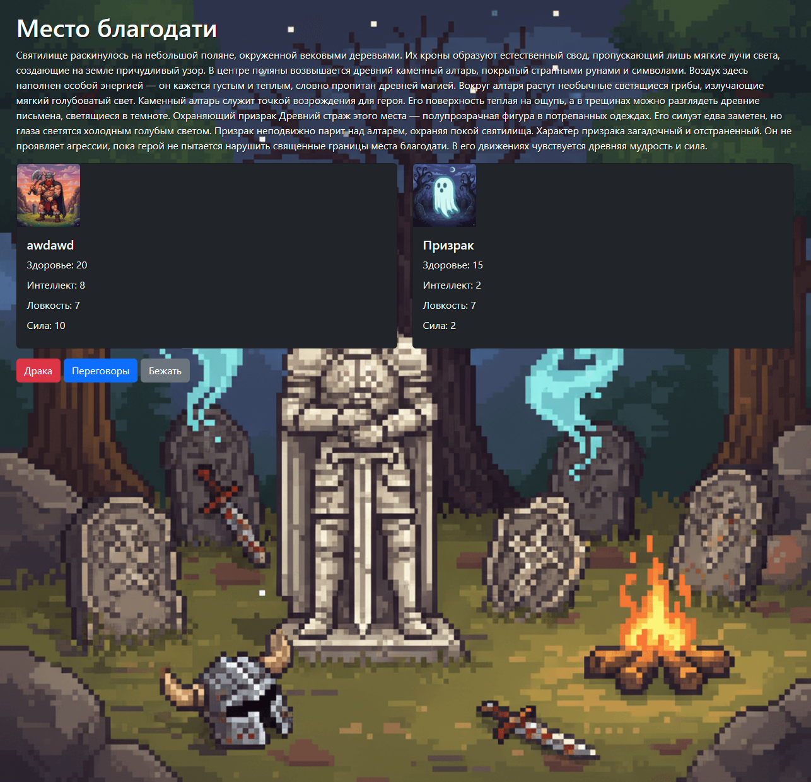
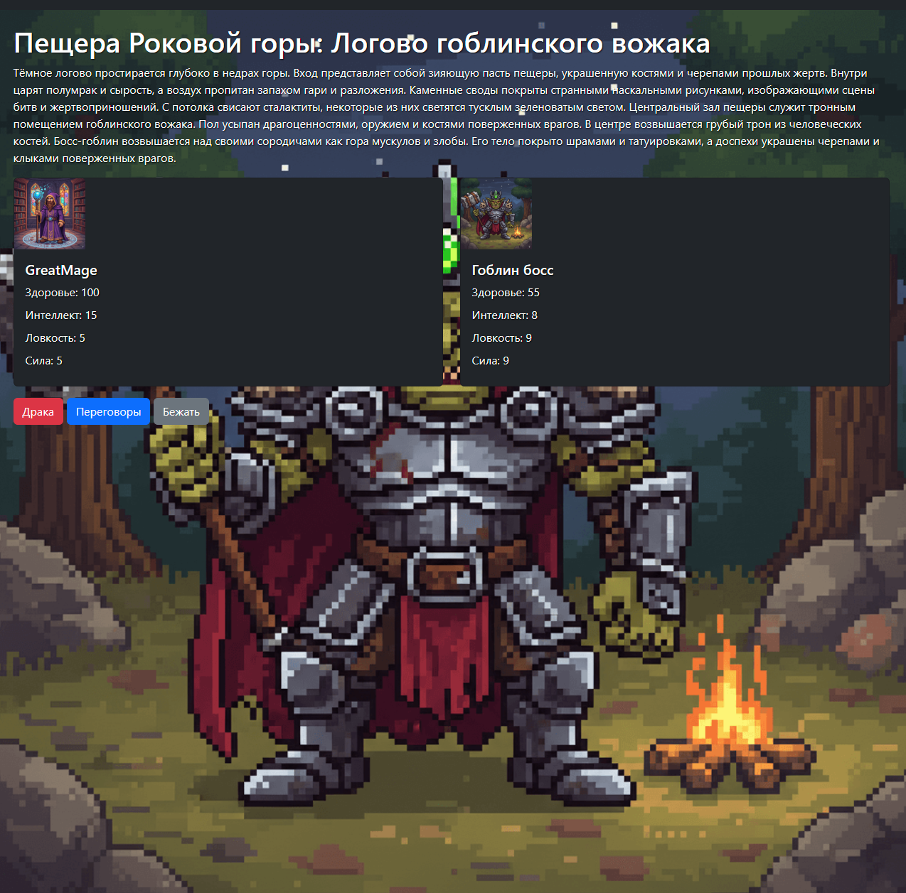
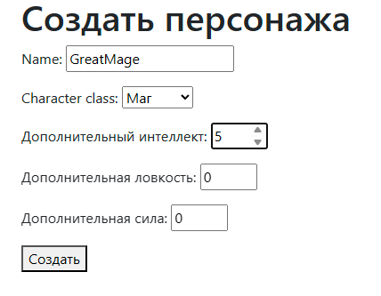

# Browser Game
ознакомиться с игрой можно по адресу http://84.201.180.139

🎮 **Browser Game** — это однопользовательская браузерная игра, разработанная с использованием Django, Docker и Nginx. Игра предоставляет пользователям увлекательный опыт в браузере с минимальными требованиями к клиентской стороне.
## 🗂 Структура проекта

```plaintext
Browser_game/
├── Browser_game/           # Основной код Django
├── deploy.sh               # Скрипт деплоя на сервер
├── docker-compose.yml      # Конфигурация Docker Compose
├── Dockerfile              # Конфигурация Docker для веб-сервера
├── game/                   # Логика игры
├── manage.py               # Управление Django
├── media/                  # Загруженные пользователями файлы
├── nginx/                  # Конфигурация Nginx
├── requirements.txt        # Зависимости Python
├── static/                 # Статические файлы
├── staticfiles/            # Собранные статические файлы
└── templates/              # HTML-шаблоны

🚀 Запуск проекта локально

1. Клонируйте репозиторий:

```git clone https://github.com/Ishikawa-Kusanagi/Browser_game.git
cd Browser_game```


2. Запустите контейнеры с помощью Docker Compose:

``docker-compose up -d --build``
3. Примените миграции и соберите статические файлы:

docker-compose exec web python manage.py migrate
docker-compose exec web python manage.py collectstatic --noinput


4. Откройте приложение в браузере:

Перейдите по адресу http://localhost

🔧 Технологии

Backend: Django

Frontend: HTML, CSS, JavaScript

Сервер: Nginx

Контейнеризация: Docker, Docker Compose

CI/CD: GitHub Actions

📸 Скриншоты
)



